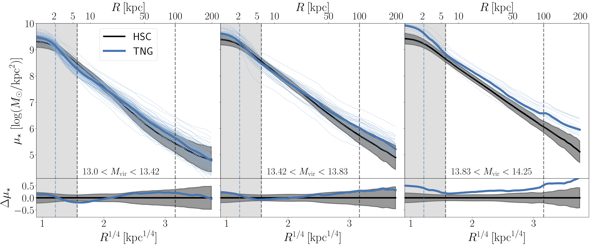

# Stellar and Weak Lensing Profiles of Massive Galaxies in the Hyper-Suprime Cam Survey and in Hydrodynamic Simulations
A repository to provide data from the Ardila et al. 2020 paper.

The median HSC profiles in each M_vir bin (shown in black in the Figure below) are available in the [`data/HSC`](data/HSC) directory.

